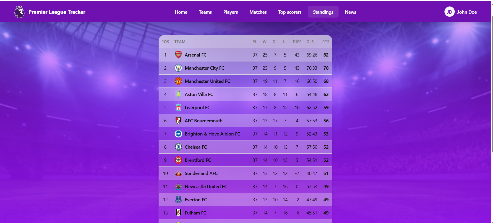
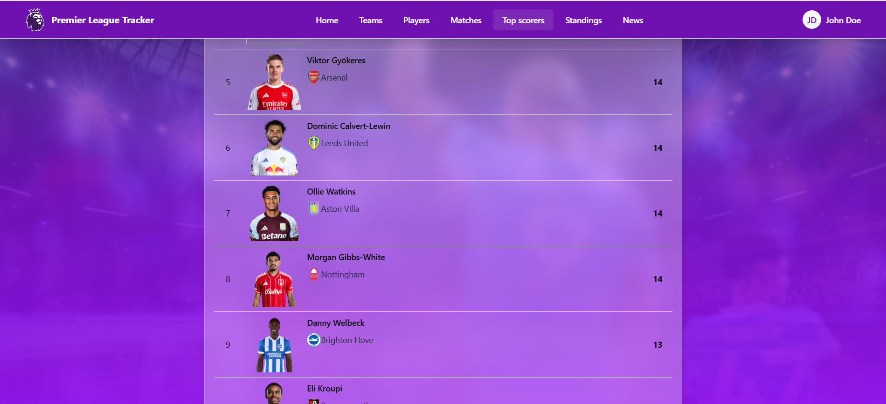
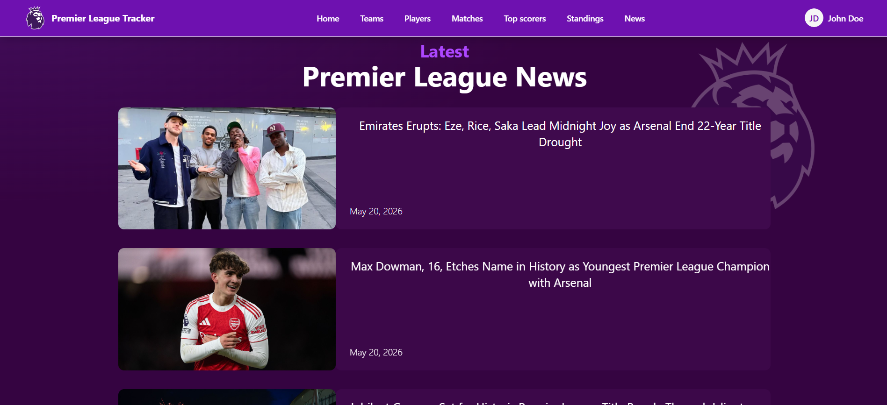
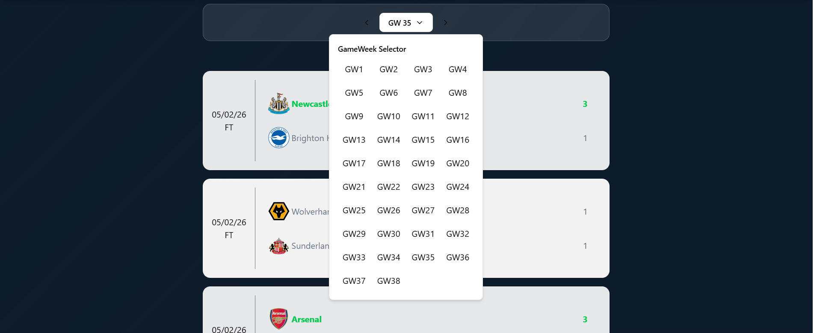
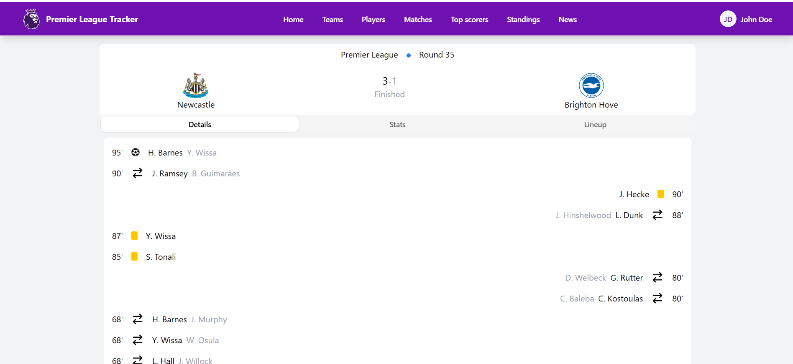
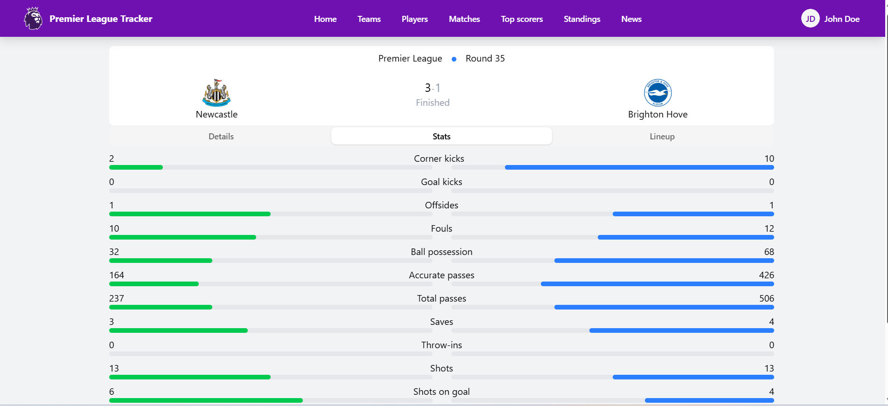
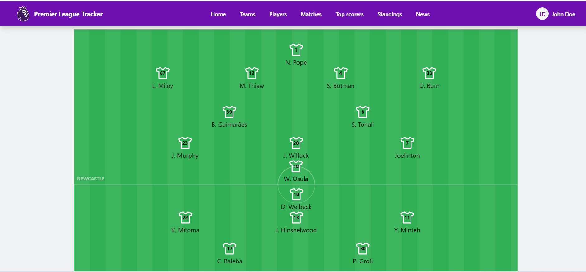

# 🏆 Premier League Tracker

Premier League Explorer is a full-stack web application that provides Premier League standings, fixtures, live match tracking, detailed statistics, lineups, and AI-generated football news in a modern and responsive interface.

Built with a Java Spring Boot backend and a React frontend, the platform architecture incorporates memory caching, scheduled background jobs, and multi-source API aggregation. Latest football headlines are enriched into full articles using the Gemini API.

## 🚀 System Architecture Overview

The backend is built using an **N-Tier Layered Architecture** (Controller-Service-Repository) designed around stateless API principles. DTOs are used to separate API contracts from database entities, while ModelMapper handles conversion between layers.

## 🛠 Tech Stack

* **Frontend:** React, TypeScript, TanStack Query (React Query), Tailwind CSS, Shadcn/ui.
* **Backend:** Java Spring Boot (Web, Data JPA), Spring Scheduling, Caffeine Cache, Lombok, ModelMapper.
* **Database & Migrations:** PostgreSQL, Liquibase (Version-controlled schema updates).
* **AI Integration:** Google Gemini API (Generative AI).
* **Data Sources:** ESPN API (Unofficial endpoints for live feeds), Football-Data.org (standings, top-scorers).

---

## ✨ Key Features

* **📅 Match Center (`/matches`):**
  Interactive gameweek-based system displaying all Premier League fixtures and results.
  Includes detailed match view with:
  - Event timeline (goals, assists, cards, substitutions)
  - Match statistics (possession, shots, passes, fouls, etc.)
  - Tactical lineups and formations

* **🏆 Standings Dashboard (`/standings`):**
  Displays the current Premier League table including points, goal difference, wins, draws, losses, and goals scored/conceded.

* **🎯 Top Scorers (`/top-scorers`):**
  Shows the top 20 goal scorers with full player and club context.

* **🤖 News (`/news`):**
  Fetches latest football headlines from ESPN API and uses Google Gemini to generate full-length articles.
  Articles are stored in the database and displayed as the latest 5 news entries.

---

## 📸 Screenshots

| Standings Dashboard | Top Scorers | AI News Feed |
| :--- | :--- | :--- |
|  |  |  |

<details open>
  <summary>📸 Click to view detailed Match Center layouts (Lineups, Stats, Timelines)</summary>
  
  #### Match list and GameWeek selector
  
  
  #### Match Details & Timeline
  
  
  #### Team Statistics Comparison
  
  
  #### Tactical Lineup Visualization
  
</details>

---

## ⚙️ Core Technical Highlights (Backend Implementation)

### ⚡ Dual-Stage Cache & Scheduler System
To reduce external API usage and improve response times, live match processing is split into a two-layer scheduler system using Caffeine Cache:

* **LiveMatchListScheduler (every 20s):**
  Fetches the daily scoreboard and identifies live matches.
  Stores lightweight `LiveMatchSnapshotDto` objects in a fast-access cache (`liveMatchListCache`) containing real-time match state (score, minute, injury time).

* **LiveMatchDetailsScheduler (every 60s):**
  Reads active match IDs from the live cache and fetches detailed match summaries (events, lineups, statistics).
  Stores enriched match data in a separate cache layer.

---

### 🔄 Match Finalization & Idempotent Data Sync
* When a match transitions from **LIVE → ENDED**, it is marked as `ENDED_PENDING_PERSIST` and passed to `MatchFinalizationService`.
* The system uses an **idempotent upsert approach** in `EspnEventUpsertService`:
  - Existing match-related data (goals, bookings, substitutions, stats) is cleared
  - Fresh data is reconstructed from the latest ESPN summary
  - This ensures consistency even when external data is re-fetched multiple times

---

### 🛡️ Dynamic Player Ingestion
* Incoming match data may include previously unseen players (e.g., debutants or academy players).
* The system automatically detects missing player records and creates them on the fly during ingestion, ensuring data consistency without interrupting processing.

---

### 📦 Database Versioning
* Uses **Liquibase** for controlled database migrations instead of Hibernate auto-DDL.
* Ensures safe, versioned schema evolution across environments.

---

## 🛣️ Project Roadmap

* [ ] **Authentication System:**
  Implement secure authentication using Spring Security with JWT-based stateless sessions and Google OAuth2 login support.

* [ ] **Deployment & Infrastructure:**
  Containerize the application using Docker with multi-stage builds and prepare a production-ready deployment setup.

* [ ] **Unified Search:**
  Introduce a global search feature for players, teams, and managers using optimized backend query logic.

* [ ] **User Personalization Features:**
  Allow users to follow specific teams and players to receive personalized updates and improve content relevance.

---

## ⚙️ Local Installation & Setup

### Prerequisites
* Java 17 SDK (or newer)
* Node.js v18+
* PostgreSQL Instance

### 1. Database Setup
Create a local PostgreSQL database named `pl_explorer`.

### 2. Backend Configuration
Navigate to `backend/src/main/resources/application.properties` and configure your environment variables:
```properties
spring.datasource.url=jdbc:postgresql://localhost:5432/pl_explorer
spring.datasource.username=your_postgres_user
spring.datasource.password=your_postgres_password

# Gemini AI Configuration
gemini.api.key=your_gemini_api_key_here

cd backend
./mvnw spring-boot:run

cd frontend
npm install
npm run dev
